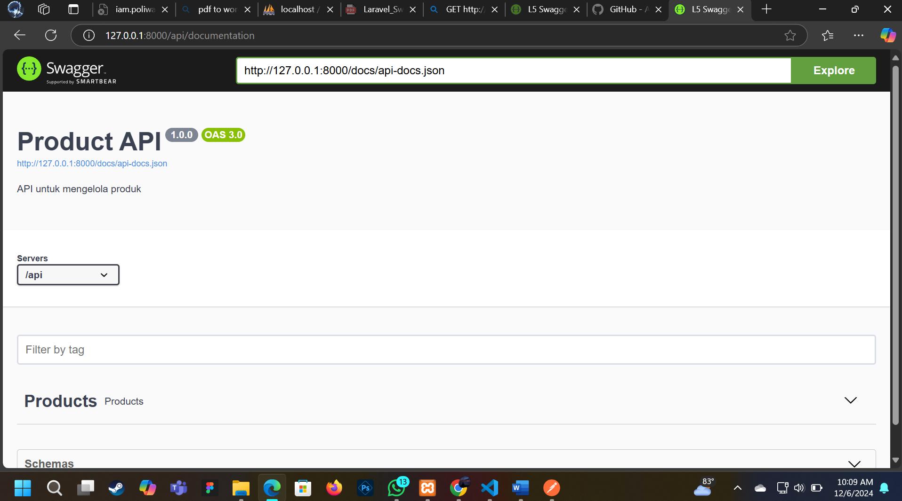
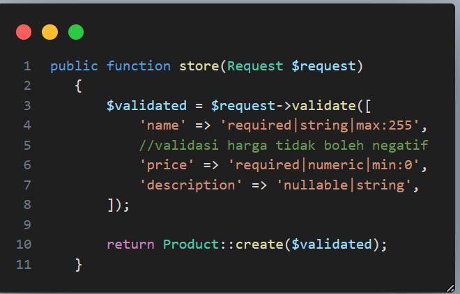
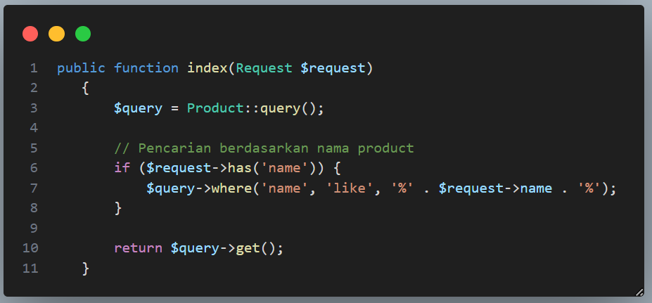
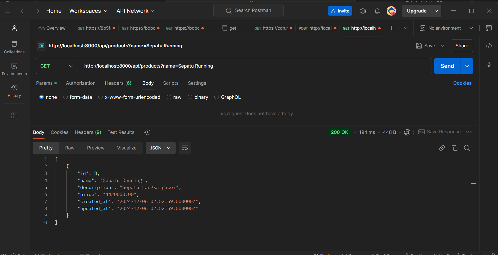

# NAMA  : ARDHANA PRASASTA
# NIM   : 362358302081
# KELAS : 2B TRPL

# PRAKTIKUMGM

# TUGAS PRAKTIKUM

1. MENAMBAHKAN VALIDASI UNTUK MEMASTIKAN HARGA PRODUCT TIDAK NEGATIF

2. MENAMBAHKAN FITUR PENCARIAN BERDASARKAN NAMA PRODUCT

3. DOKUMENTASI SWAGGER UNTUK PENCARIAN TERSEBUT

